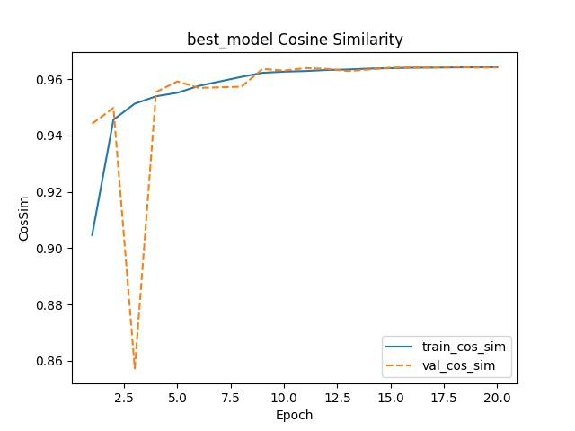
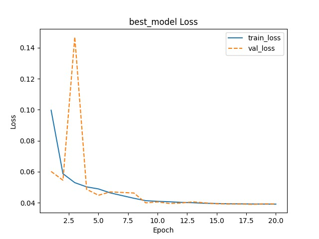
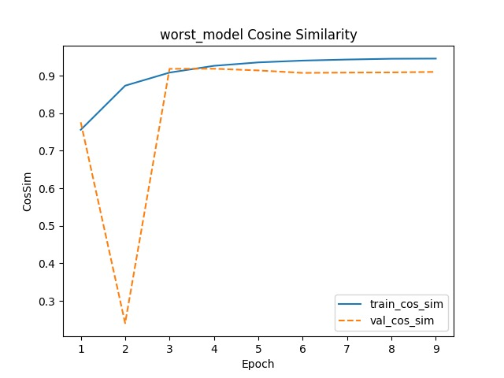
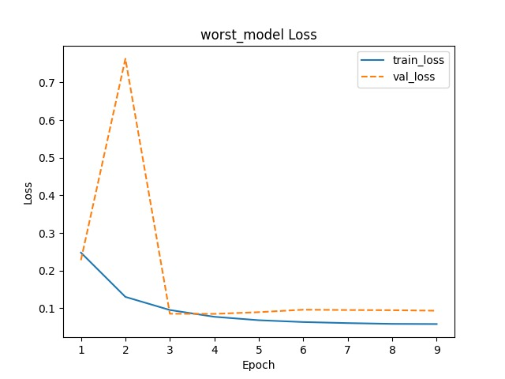

# Surface Normals Prediction

This repository implements a full pipeline for predicting surface normal maps from object screenshots, including data preprocessing, model training with hyperparameter tuning, and a FastAPI for inference.

---

## 📁 Directory Hierarchy

```
script_directory/  (project root)
├─ data/
│  ├─ raw_data/                                 # Original .ply mesh files: obj_01.ply … obj_14.ply
│  ├─ preprocessed_data/                        # Feature-extraction & analysis outputs
│  ├─ postprocessed_data/                       # Rendered screenshots & normals
│  │  ├─ screenshots/
│  │  │  ├─ obj_01/ … obj_14/                   # RGB-lit screenshots per orientation
│  │  └─ normals/
│  │     ├─ obj_01/ … obj_14/                   # Normal-map renders per orientation
│  └─ predicted_data/                           # Model validation predictions
│     ├─ obj_01/ … obj_14/                      # Predictions per object (best & worst)
├─ hyperparameter_optimisation/_optimisation/
│  ├─ kt_dense_norm_tuning/
│  │  └─ dense_norm_pred/                       # Keras-Tuner outputs & trials
│  │     ├─ trial_0000/ … trial_0029
│  │     └─ tuner0.json                         # Tuner state for reload
│  └─ exported_dense_normal_model/              # Final models, hyperparameters, & summaries
│     ├─ best_dense_normal_model.keras
│     ├─ best_hyperparameters.json
│     ├─ worst_dense_normal_model.keras
│     ├─ worst_hyperparameters.json
│     ├─ performance_summary.json
│     └─ trial_scores.json                      # Aggregated trial scores
├─ scripts/                                     # All Python scripts
│  ├─ evaluation_scripts/
│  │  ├─ evaluate_trial_scores.py               # Analyze & visualize hyperparameter tuning trial scores
│  │  └─ extract_metrics.py                     # Extract final loss & accuracy metrics from tuning trials
│  ├─ config.py                                 # Centralized path config
│  ├─ data_datapreprocessing.py                 # Raw → PCA features
│  ├─ data_postprocessing.py                    # Rotate & render meshes per orientation
│  ├─ extract_models.py                         # Summarize trial scores into JSON
│  ├─ train_model.py                            # Hyperparameter tuning & model export
│  ├─ streamlit.py                              # Streamlit Demo 
│  └─ main.py                                   # FastAPI server entrypoint
├─ requirements.txt                             # Third-party dependencies
├─ Dockerfile
└─ README.md                                    # You are here
```

---

## 🚀 Setup & Installation

1. **Clone the repo** and change into the project directory:

   ```bash
   git clone https://github.com/DanDumitruArdeleanu/Applied-ML-Group8.git
   cd Applied-ML-Group8
   ```

2. **Create a virtual environment** and activate it:

   ```bash
   python -m venv .venv
   source .venv/bin/activate      # macOS/Linux
   # .\.venv\Scripts\activate   # Windows PowerShell
   ```

3. **Install required packages**:

   ```bash
   pip install --upgrade pip
   pip install -r requirements.txt
   ```

4. **Downloading Postprocessed Data**:

  Google Drive link: https://drive.google.com/file/d/1GdDcnN_wJkE4gFuO9UmRgk-pOfvx4_Kl/view?usp=drive_link
   
   ```bash
   gdown --id 1GdDcnN_wJkE4gFuO9UmRgk-pOfvx4_Kl `
       --output .\Data\postprocessed_data.zip    # Downloading with gdown in terminal
   ```

  Extract the data from the .zip file and replace the postprocessed_data with the new folder

  Delete the .zip file

---

## 🛠️ Usage

### 1. Data Preprocessing & Rendering

* **Preprocess raw `.ply` meshes** and compute PCA features:

  ```bash
  python scripts/data_datapreprocessing.py
  ```

* **Generate rotated screenshots & normal maps**:

  ```bash
  python scripts/data_postprocessing.py
  ```

  Outputs are placed in:

  ```bash
  data/postprocessed_data/screenshots/obj_XX/
  data/postprocessed_data/normals/obj_XX/
  ```

### 2. Hyperparameter Tuning & Model Export

* **Run training with Keras-Tuner**:

  ```bash
  python scripts/train_model.py
  ```

  * Tuner outputs -> `hyperparameter_optimisation/kt_dense_norm_tuning/dense_norm_pred`
  * Final models & hyperparameters -> `hyperparameter_optimisation/exported_dense_normal_model`

* **Summarize trial scores** (extract\_models.py):

  ```bash
  python scripts/extract_models.py
  ```

  Produces `trial_scores.json` in the exported model directory.

* **Generate validation predictions**: included at end of `train_model.py`, saved into:

  ```bash
  data/predicted_data/obj_XX/best_prediction/
  data/predicted_data/obj_XX/worst_prediction/
  ```

### 3. Running the API Server and Streamlit Demo

1. **Start the server** (from project root):

   ```bash
   uvicorn scripts.main:app --reload
   ```

2. **Browse the API docs**:
   Open your browser to:

   ```
   http://127.0.0.1:8000/docs
   ```

   Use the interactive docs to test the `/predict/` endpoint.

3. **Streamlit Demo**:
   Make sure to have FastAPI running before starting the demo:

   ```
   streamlit run scripts/streamlit.py
   ```

### 4. Evaluation & Metrics Extraction

* **Evaluate trial scores and generate visualizations**:

  ```bash
  python scripts/evaluation_scripts/evaluate_trial_scores.py
  python scripts/evaluation_scripts/extract_metrics.py
  ```

  Outputs are placed in:

  ```bash
  evaluation/
  ```

---

## 📈 Results Summary

Below, we present the key findings from our model evaluations.

- Total Trials: 30
- Best Trial (0024): 0.9693 Cosine Similarity
- Worst Trial (0006): 0.8094 Cosine Similarity
- Statistically Significant Improvement: ✅ (based on 95% confidence interval analysis)

_Note: A cosine similarity of 0 indicates that the predicted and true surface normals are, on average, orthogonal, showing no meaningful alignment and effectively equivalent to random guessing. Our models, achieving scores well above 0, therefore perform significantly better than chance._

---

### 📊 Evaluation Visualizations

#### Best Model

* Accuracy

  

* Loss

  

---

#### Worst Model (Baseline)

* Accuracy

  

* Loss

  

---

## Running the Project with Docker

1. **Clone the repo** and navigate into the project directory:

   ```bash
   git clone https://github.com/DanDumitruArdeleanu/Applied-ML-Group8.git
   cd Applied-ML-Group8
   ```
2. **Download Docker Desktop**, from the following link:
   ```
   https://www.docker.com/products/docker-desktop/
   ```

3. **Build The Docker Image**:
   ```
   docker build --shm-size=2g -t my-ml-app .
   ```

4. **Run Docker**:
   ```
   docker run --shm-size=2g -p 8000:8000 my-ml-app
   ```

---

## 🔧 Configuration

All file and folder paths are managed centrally in `scripts/config.py`. Modify there if you need to relocate data or outputs.

---
